

  <h2>MyPage: Full-Stack News, Weather, and Personal Dashboard Application</h2>
  
  

 

  
  
  
  
  

  
  
  
  

  
  
  
  
  
  

  
  
  
  
  

  
  
  
  
  

---

    <a href="#about">About</a> •
    <a href="#features">Features</a> •
    <a href="#visuals">Key Visuals</a> •
    <a href="#tech">Tech Stack</a> •
    <a href="#installation">Installation</a> •
    <a href="#database">Database</a> •
    <a href="#api">API</a> •
    <a href="#future">Future Features</a>

---

## 💡 About the Project

**MyPage** is a full-stack web application that combines **news, weather, bookmarks, and personalized profile settings** into one dashboard experience.

Users can register with email and password or sign in with **Google** or **GitHub** using OAuth2. Once authenticated, they can browse top headlines by category, save articles as bookmarks, manage their profile, and personalize their weather experience. The application also includes secure password recovery functionality using time-limited reset tokens sent via email.

By default, OAuth users see **Chicago weather** when they first log in. After editing their profile, they can save their preferred city and use that as their default weather location going forward.

The front end is built with **React and Vite**, while the back end is powered by **Spring Boot, Spring Security, Hibernate, and MySQL**. The application also integrates external APIs for news and weather, stores profile images in **Amazon S3**, and is deployed with **Netlify**, **AWS Elastic Beanstalk**, and **Amazon RDS**.

This project was developed as my **LaunchCode Unit 2 full-stack capstone project** and reflects my interest in building secure, user-focused applications with real-world API integrations and cloud deployment.

---

## 🎨 Features

### Authentication and User Access
- **User Registration and Login:** Secure account creation and login with JWT-based authentication
- **OAuth2 Login:** Sign in with Google or GitHub
- **Protected Experience:** The application is designed for authenticated users
- **Session-Based Personalization:** Users can access features tied to their own account and saved preferences
- **Forgot Password:** Users can request a password reset link via email  
- **Secure Password Reset:** Users can reset their password using a time-limited token  

### News Features
- **Top Headlines by Category:** Browse news by category from the dashboard
- **Article Bookmarking:** Save and remove articles from bookmarks
- **Bookmark Persistence:** Bookmarked articles are stored in the database for each user
- **Paginated Bookmarks Modal:** Bookmarks are shown with pagination for a cleaner UI

### Weather Features
- **Default Chicago Weather for OAuth Users:** New OAuth users see Chicago weather by default
- **Preferred City Support:** Users can update their profile and save a city as their default weather location
- **Weather Search:** Users can search weather for cities
- **Weather History:** Recent weather searches are saved for authenticated users
- **Weather History Management:** Users can delete individual weather history entries or clear all saved weather history

### Profile Features
- **Profile Editing:** Users can update profile details
- **Profile Picture Upload:** Users can upload a profile image
- **Cloud Image Storage:** Profile images are stored in Amazon S3

### Security and Backend Features
- **Spring Security Integration:** Secures API routes and authenticated user flows
- **JWT Authentication:** Token-based authentication for secure sessions
- **OAuth2 Integration:** Supports Google and GitHub sign-in flows
- **RESTful API Design:** Organized API structure for authentication, news, weather, bookmarks, and profile features
- **Cloud Deployment:** Front end deployed on Netlify and back end deployed on AWS Elastic Beanstalk

 ### Responsive Design
- **Desktop, iPad, and Mobile Support:** The application is designed to provide a responsive experience across multiple screen sizes
- **Adaptive Layouts:** News, weather, profile, and bookmark views adjust for usability on large screens, tablets, and phones
- **Improved User Experience:** Responsive styling helps maintain readability, navigation, and interaction across devices 

---

## 📸 Key Visuals

### Wireframes

  
Click here to toggle diagrams.
 
  <em>Click on image to view in Figma.</em>
  <a href="https://www.figma.com/design/Tlv5azmgUYGNpkvTsIw8N0/My-Page---unit-2---The-source-of-wisdom?node-id=0-1&t=ORERwAiUDJ4jMUNf-1">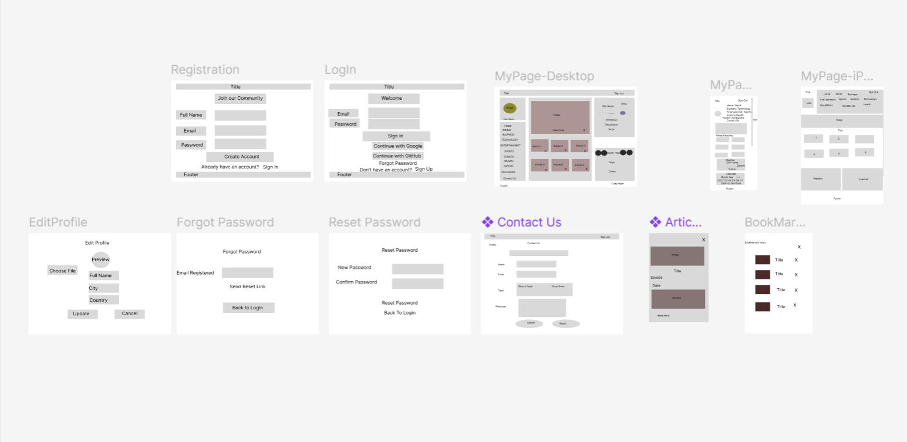</a>

### Preview of UI

### Responsive Design Preview

  
Responsive Views for desktop, iPad, and mobile layouts.

  
  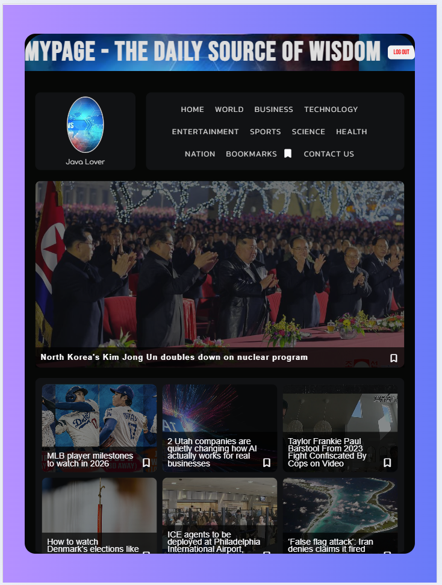
  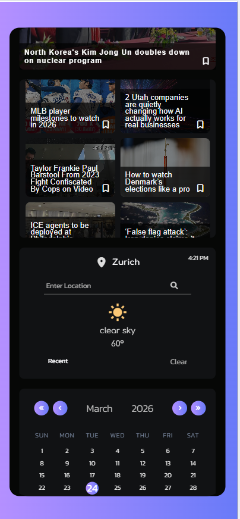

#### AUTHENTICATION

  
Login, Register,OAuth and Password Reset

  
  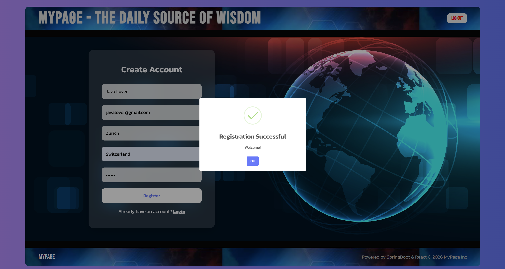
  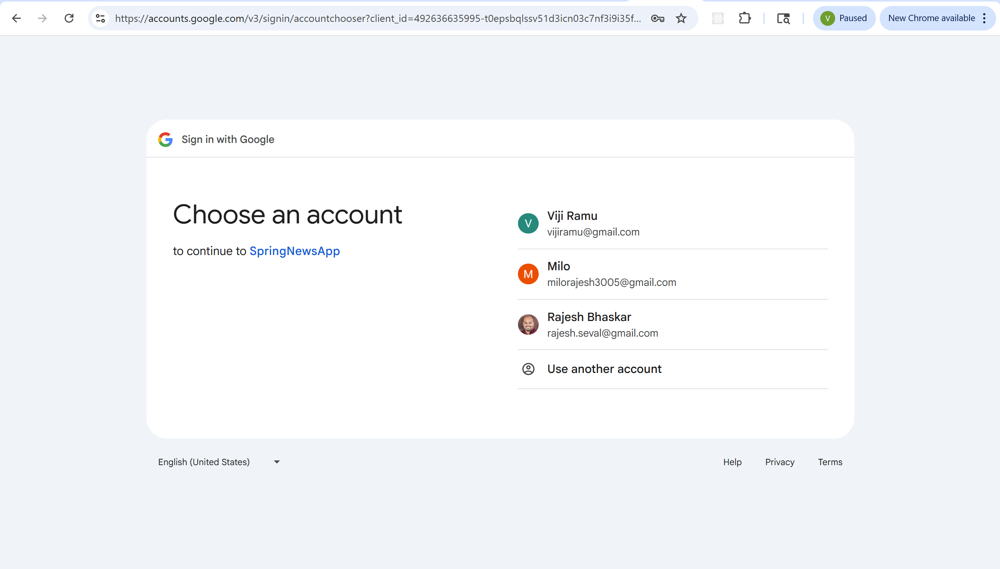
  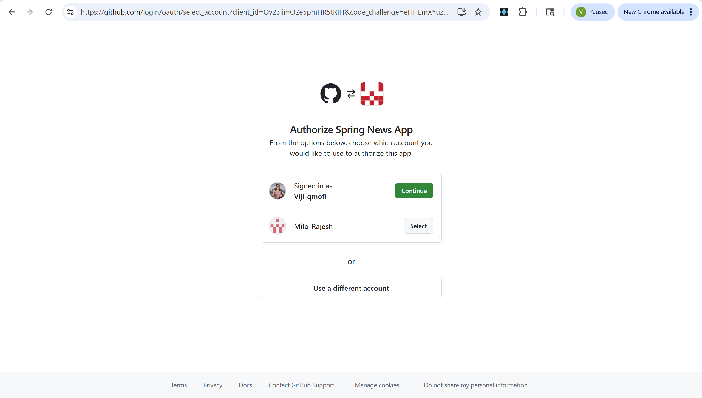
    
  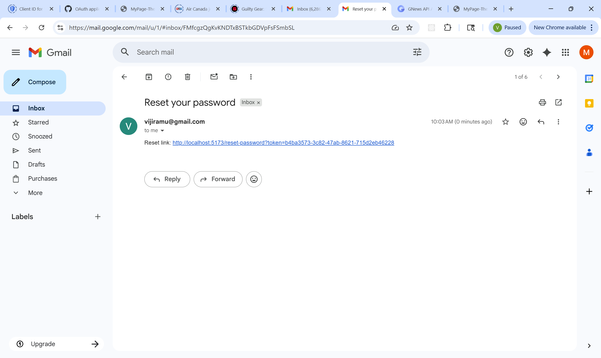  
    

#### DASHBOARD AND CONTENT

  
News and Weather

  
  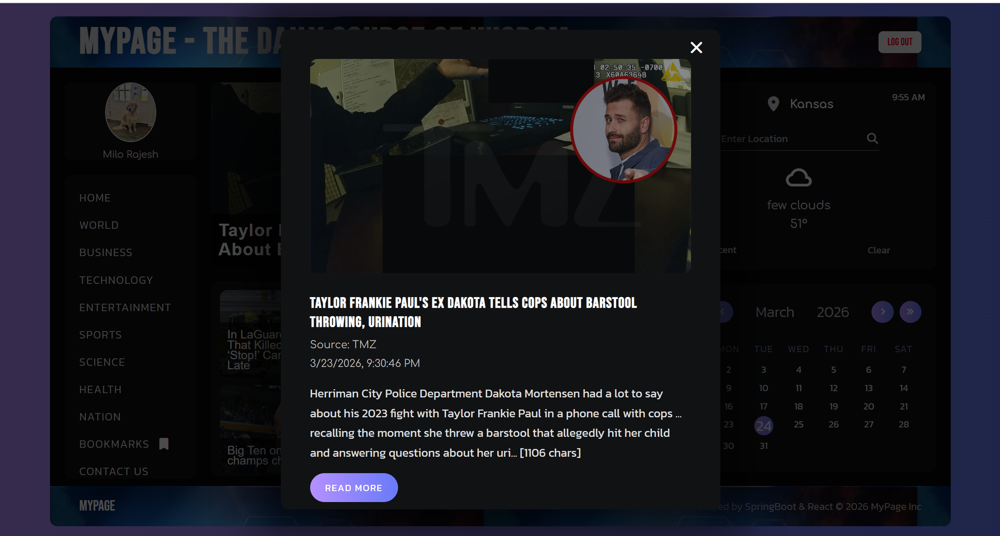 

  
Bookmarks

  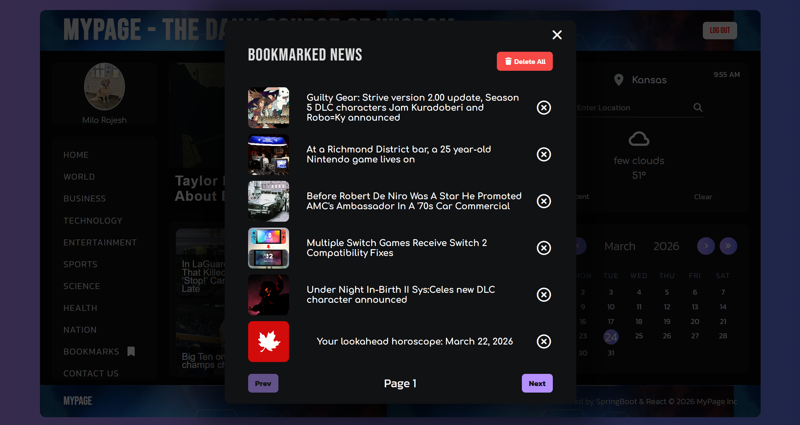

  
Contact Us

  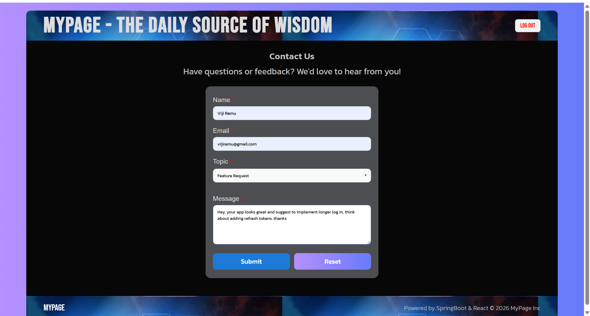

#### PROFILE

  
Profile Management

  

---

## 🛠️ Tech Stack

This project uses a modern full-stack architecture with a React front end, a Spring Boot REST API, MySQL persistence, third-party API integrations, and cloud deployment.

### Front End

| Technology | Description |
| ---: | :--- |
|  | Component-based UI library used to build the application interface |
|  | Core language used for application logic and interactivity |
|  | Development tooling for fast builds and hot module replacement |
|  | Client-side routing for page navigation |
|  | Used for communication with the back-end API |
|  | Custom styling, layout, and responsive design |
|  | Icon library used throughout the interface |
|  | Typography customization for the application UI |
|  | User-friendly alerts and feedback messages |

### Back End, Security, and Database

| Technology | Description |
| ---: | :--- |
|  | Main back-end programming language |
|  | Framework used to build the REST API and application services |
|  | Handles authentication, authorization, and protected routes |
|  | Token-based authentication for secure user sessions |
|  | Enables Google and GitHub login integration |
|  | ORM for interacting with the relational database |
|  | Relational database used for users, bookmarks, roles, and weather history |
|  | Dependency management and build tool |

### APIs, Cloud, and Deployment

| Technology | Description |
| ---: | :--- |
|  | Provides top headlines and article data |
|  | Provides weather data for default and user-selected cities |
|  | Stores uploaded profile images |
|  | Hosts the Spring Boot back end |
|  | Managed MySQL database in production |
|  | Hosts the React front end |

---

## 🚀 Prerequisites & Installation

> [!NOTE]
> To run this project locally, you will need:
> - Node.js
> - npm
> - Java JDK
> - Maven
> - MySQL Server
> - GNews API key
> - OpenWeather API key
> - Google OAuth credentials
> - GitHub OAuth credentials
> - AWS configuration if testing S3 uploads locally

---

### 🔧 Setup Steps

#### 1. Clone the repository

    git clone https://github.com/your-username/your-repository-name.git
    cd spring-news-app

#### 2. Create the database

    CREATE DATABASE mypage_db;

#### 3. Configure backend environment variables

   spring.application.name=spring-news-app
   
#### DATABASE CONFIG
spring.datasource.url=${DB_URL}
spring.datasource.username=${DB_USERNAME}
spring.datasource.password=${DB_PASSWORD}
spring.jpa.hibernate.ddl-auto=update
spring.jpa.show-sql=true
server.port=5000

#### JWT CONFIG
jwt.secret=${JWT_SECRET}
jwt.expiration=86400000

logging.level.org.springframework.security=DEBUG

#### News and Weather API key
gnews.api.key=${GNEWS_API_KEY}  # set in environment variable
gnews.api.url=https://gnews.io/api/v4

weather.api.key=${WEATHER_KEY}

file.upload-dir=uploads

#### Gmail App setup
spring.mail.host=smtp.gmail.com
spring.mail.port=587
spring.mail.username=vijiramu@gmail.com
spring.mail.password=${GMAIL_APP_PASSWORD}
spring.mail.properties.mail.smtp.auth=true
spring.mail.properties.mail.smtp.starttls.enable=true
app.frontend.url=https://mypagefullstack.netlify.app

#### Google OAuth
spring.security.oauth2.client.registration.google.client-id=${GOOGLE_CLIENT_ID}
spring.security.oauth2.client.registration.google.client-secret=${GOOGLE_CLIENT_SECRET}
spring.security.oauth2.client.registration.google.scope=openid,profile,email

#### GitHub OAuth
spring.security.oauth2.client.registration.github.client-id=${GITHUB_CLIENT_ID}
spring.security.oauth2.client.registration.github.client-secret=${GITHUB_CLIENT_SECRET}
spring.security.oauth2.client.registration.github.scope=read:user,user:email

#### Profile image file storage
aws.s3.bucket-name=${AWS_S3_BUCKET_NAME}
aws.region=${AWS_REGION}

#### Fix OAuth redirect URI behind proxy
server.forward-headers-strategy=framework

#### Google OAuth callback
spring.security.oauth2.client.registration.google.redirect-uri=https://api.mypagebackend.com/login/oauth2/code/{registrationId}

#### GitHub OAuth callback
spring.security.oauth2.client.registration.github.redirect-uri=https://api.mypagebackend.com/login/oauth2/code/{registrationId}

#### 4. Run the backend

    mvn spring-boot:run

    http://localhost:8080

#### 5. Set up and run the frontend

    cd ../client
    npm install

    VITE_API_BASE_URL=http://localhost:8080/api
    VITE_BACKEND_URL=http://localhost:8080

    npm run dev

    http://localhost:5173

   ---

## 🗄️ Database Structure

This project uses a **MySQL relational database** designed to support authentication, personalization, and user-driven features such as bookmarks and weather history.

### Core Entities

- **User** — stores user credentials, profile details, preferred city/country, and OAuth provider info  
- **Role** — defines user roles (e.g., ROLE_USER, ROLE_ADMIN)  
- **Bookmark** — stores articles saved by users  
- **WeatherSearchHistory** — tracks previously searched cities  
- **PasswordResetToken** — stores secure, time-limited tokens for password reset functionality

### Relationships

1. **User ↔ Role**: Many-to-Many  
2. **User ↔ Bookmark**: One-to-Many  
3. **User ↔ WeatherSearchHistory**: One-to-Many  
4. **User ↔ PasswordResetToken**: One-to-One (or One-to-Many depending on lifecycle)

### Entity Relationship Diagram (ERD)

  
Click here to toggle view of ERD
 
  <em>>Click on image to view ERD in dbdiagram.io</em> 
  <a href="https://dbdiagram.io/d/MyPageERD-69af432e77d079431b41100e">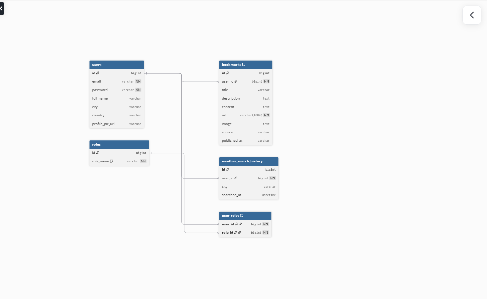</a>

---

## ⚙️ API Endpoints

The following RESTful endpoints manage authentication, news, weather, and user-specific data.

> **Note:** Most endpoints require a valid JWT in the `Authorization` header.

---

### 🔐 Authentication

| HTTP Method | Endpoint | Description | Access |
| :--- | :--- | :--- | :--- |
| 🟡 `POST` | `/api/auth/register` | Register a new user | 🌎 Public |
| 🟡 `POST` | `/api/auth/login` | Authenticate user and return JWT | 🌎 Public |
| 🟢 `GET` | `/api/auth/oauth-user` | Get authenticated OAuth user details | 🔐 Authenticated |
| 🟡 `PUT` | `/api/auth/update-profile` | Update user profile details (name, city, profile picture, etc.) | 🔐 Authenticated |

### 🔑 Password Reset

| HTTP Method | Endpoint | Description | Access |
| :--- | :--- | :--- | :--- |
| 🟡 `POST` | `/api/auth/forgot-password` | Send password reset email with token | 🌎 Public |
| 🟡 `POST` | `/api/auth/reset-password` | Reset password using token | 🌎 Public |

---

### 📰 News

| HTTP Method | Endpoint | Description | Access |
| :--- | :--- | :--- | :--- |
| 🟢 `GET` | `/api/news/top?category=...` | Get top headlines by category | 🔐 Authenticated |

---

### 🌤️ Weather

| HTTP Method | Endpoint | Description | Access |
| :--- | :--- | :--- | :--- |
| 🟢 `GET` | `/api/weather` | Get weather for a searched city | 🔐 Authenticated |
| 🟢 `GET` | `/api/weather/me` | Get weather for user's preferred city | 🔐 Authenticated |
| 🟢 `GET` | `/api/weather/history` | Retrieve weather search history | 🔐 Authenticated |
| 🔴 `DELETE` | `/api/weather/history/{id}` | Delete a weather history record by ID | 🔐 Authenticated |
| 🔴 `DELETE` | `/api/weather/history` | Delete all weather history for the current user | 🔐 Authenticated |

---

### 🔖 Bookmarks

| HTTP Method | Endpoint | Description | Access |
| :--- | :--- | :--- | :--- |
| 🟡 `POST` | `/api/bookmarks/add` | Add a bookmarked article | 🔐 Authenticated |
| 🔴 `DELETE` | `/api/bookmarks/delete?url=...` | Delete bookmark by URL | 🔐 Authenticated |
| 🔴 `DELETE` | `/api/bookmarks/delete-all` | Delete all bookmarks | 🔐 Authenticated |
| 🟢 `GET` | `/api/bookmarks/get` | Get paginated bookmarks | 🔐 Authenticated |
| 🟢 `GET` | `/api/bookmarks/getAll` | Get all bookmarked URLs | 🔐 Authenticated |

---

### ❤️ Health Check

| HTTP Method | Endpoint | Description | Access |
| :--- | :--- | :--- | :--- |
| 🟢 `GET` | `/api/health` | Application health check endpoint | 🌎 Public |

---

## 🔮 Future Features

Several enhancements are planned to extend functionality and improve user experience.

### 🔐 Security Enhancements
- Implement **refresh tokens** for longer-lived sessions  
- Transition to **httpOnly cookies** for improved security  

### 🤖 AI-Powered Features
- AI-generated **news summaries and insights**  
- AI-based **weather recommendations** based on user preferences  

### 📈 Product Improvements
- Expand the **calendar feature** with backend integration  
- Add **advanced news filtering and search capabilities**  
- Improve **profile customization options**  
- Enhance bookmark organization with **folders or tags**  

---

## 🧑‍💻 Author

**Vijayalakshmi Ramu** - [@ GitHub](https://github.com/viji-qmofi) - [LinkedIn](https://www.linkedin.com/in/vijiramu)
